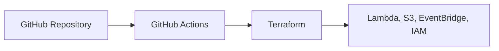
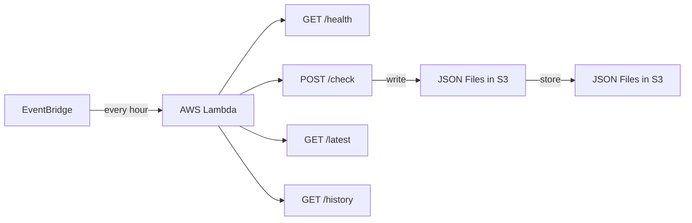

# Uptime Monitor

Uptime Monitor is a serverless AWS project built with Go, Lambda, EventBridge, S3, OpenTofu (Terraform-compatible), and GitHub Actions.

It monitors multiple websites on an hourly schedule, stores the latest status snapshot and recent history in S3, and exposes lightweight HTTP endpoints through a Lambda Function URL for manual checks and dashboard data.

[Full Documentation](./docs/README.md)

---

## Case Studies

| Case Study | Problem | How it was diagnosed | Result |
| :--- | :--- | :--- | :--- |

---

## Architecture

The system runs as a small serverless monitoring loop: Terraform provisions AWS resources, EventBridge triggers scheduled Lambda checks, and S3 stores the latest and historical status data.

| Path | Use case | Flow |
| :--- | :--- | :--- |
| Scheduled monitoring | Check configured websites every hour | EventBridge -> Lambda -> monitored sites -> S3 |
| Manual operation | Trigger checks or read monitor data on demand | Lambda Function URL -> `/check`, `/latest`, `/history`, `/health` |
| Runtime storage | Keep latest and recent historical status data | Lambda -> S3 `latest.json` and `history.json` |
| Infrastructure deployment | Keep AWS resources managed from source control | GitHub Actions -> Terraform -> AWS resources |

Deployment flow:



Runtime flow:



---

## Tech Stack

| Layer | Tools |
| :--- | :--- |
| Language | Go |
| Compute | AWS Lambda |
| Scheduling | Amazon EventBridge |
| Storage | Amazon S3 |
| Infrastructure | Terraform |
| Testing | Go `testing` package, table-driven tests |
| CI/CD | GitHub Actions |

---

## API Endpoints

| Endpoint | Method | Purpose |
| :--- | :--- | :--- |
| `/health` | `GET` | Returns Lambda service health |
| `/check` | `POST` | Runs uptime checks and writes results to S3 |
| `/latest` | `GET` | Returns the latest status snapshot |
| `/history` | `GET` | Returns recent status history grouped by URL |

---

## Documentation

- [Documentation Hub](./docs/README.md)
- [Architecture](./docs/architecture/README.md)
- [Decisions](./docs/decisions/README.md)
- [Incidents](./docs/incidents/README.md)

---

## Local Setup

Build and test the Go backend:

```bash
make test
make lambda-package
```

Deploy infrastructure locally:

```bash
cd infra
tofu init
tofu apply
```

Trigger a manual check:

```bash
curl -X POST "$(tofu output -raw lambda_function_url)check"
```

Read monitor data:

```bash
curl "$(tofu output -raw lambda_function_url)latest"
curl "$(tofu output -raw lambda_function_url)history"
```
